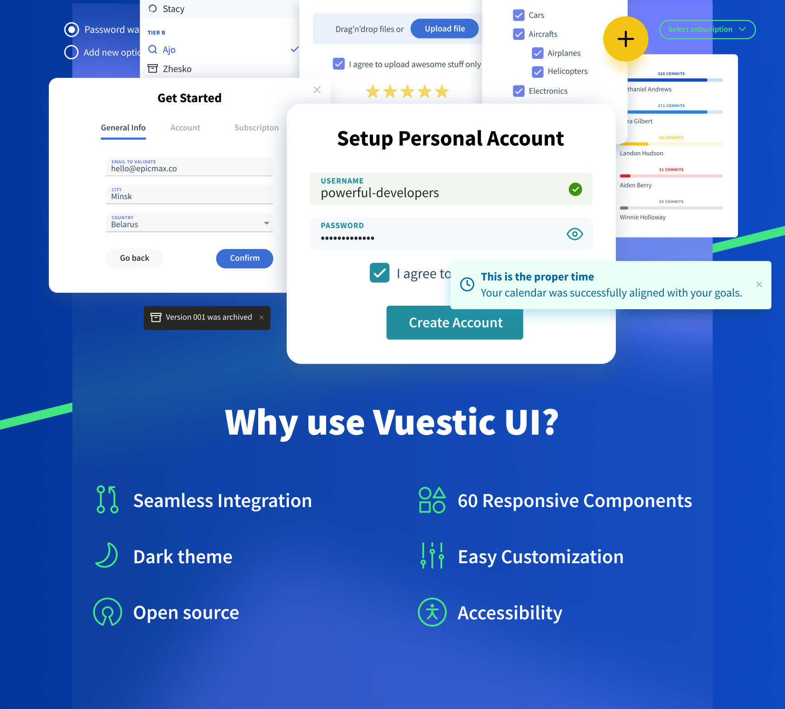

<p align="center">
  <a href="https://vuestic.dev" target="_blank">
      
  </a>
      <br>
  Vue.js 3.0 UI Library
  <br>
  Developed by <a href="https://epicmax.co">Epicmax</a>. Designed by
  <a href="https://twitter.com/xxsavitski">Vasili Savitski</a>.
  <br>
</p>

<p align="center">
  <a href="https://github.com/epicmaxco/vuestic-ui/tree/develop/packages/extensions/ag-grid-theme">
    
  </a>
  <a href="https://github.com/epicmaxco/vuestic-ui/tree/develop/packages/vue-cli-plugin">
    
  </a>
</p>

<p align="center">
  <a href="https://app.circleci.com/pipelines/github/epicmaxco/vuestic-ui">
    
  </a>
  <a href="https://github.com/epicmaxco/vuestic-ui/blob/develop/LICENSE.MD">
    
  </a>
  <a href="https://www.npmjs.com/package/vuestic-ui">
    
  </a>
</p>

<p align="center">
  <a href="https://vuestic.dev/">Documentation</a>
  |
  <a href="https://discord.gg/u7fQdqQt8c">Discord</a>
</p>

> Vuestic UI is forever free and open to contributions. See our
<a href="https://github.com/epicmaxco/vuestic-ui/issues">issues</a>,
<a href="https://vuestic.dev/en/contribution/guide">contributing guide</a> and join discussions on our
<a href="https://discord.gg/u7fQdqQt8c">Discord</a> to help us improve Vuestic UI experience.

  <p align="center">
    
  </p>

### Why use Vuestic UI?

- Vue.js 3.0 compatible
- Accessibility
- Dark Theme support
- Feature-rich: more than 60 customizable components
- Two built-in color scheme presets
- Powerful configurations:
    - Local - configure components in-depth
    - Global - configure framework overall
- Cross-browser and responsive
- i18n-ready
- MIT license

### Installation

First, make sure you have all prerequisites installed:

* [Node.js](https://nodejs.org/en/) ( >=14.*)
* [npm](https://www.npmjs.com/get-npm) version 3+ (
  or [yarn](https://yarnpkg.com/lang/en/docs/install) version 1.16+)
  and [Git](https://git-scm.com).

After checking the prerequisites, install Vuestic UI via npm/yarn:

```shell
npm install vuestic-ui
//or
yarn add vuestic-ui
```

### Quick start

Make sure you've imported both styles and plugin into your entry file:

```javascript
//main.js
import { createApp } from 'vue'
import App from './App.vue'
import { createVuestic } from 'vuestic-ui'
import 'vuestic-ui/css'

createApp(App)
  .use(createVuestic())
  .mount('#app')
```

### Documentation

Information, guides and tutorials are available
on [vuestic.dev](https://vuestic.dev)

### Partners & Sponsors ❤️
<div>
  <a href="https://vuejs.org/partners/epicmax.html" target="_blank" title="VueJS - The Progressive JavaScript Framework">
    <picture>
      <source media="(prefers-color-scheme: dark)" srcset="./.github/assets/vuejs-light.svg" />
      
    </picture>
  </a>
  <a href="https://nuxt.com/support/agencies/epicmax" target="_blank" title="Nuxt - The Intuitive Web Framework">
    <picture>
      <source media="(prefers-color-scheme: dark)" srcset="./.github/assets/nuxt-light.svg" />
      
    </picture>
  </a>
  <a href="https://epicmax.co/" target="_blank" title="Epicmax - Top Vue.js Development Company"></a>
  <br />
  <br />
  <a href="https://www.ag-grid.com/" target="_blank" title=" Data Grid: AG Grid: High-Performance React Grid, Angular Grid, JavaScript Grid">
    <picture>
      <source media="(prefers-color-scheme: dark)" srcset="./.github/assets/aggrid-light.svg" />
      
    </picture>
  </a>
  <a href="https://vuejobs.com/" target="_blank" title="Vue.js jobs – Browse through dozens of Vue.js openings">
    <picture>
      <source media="(prefers-color-scheme: dark)" srcset="./.github/assets/vuejobs-light.svg" />
      
    </picture>
  </a>
  <a href="https://flatlogic.com/" target="_blank" title="Flatlogic - The best way to create React, Angular and Vue full-stack web applications">
    <picture>
      <source media="(prefers-color-scheme: dark)" srcset="./.github/assets/flatlogic-light.svg" />
      
    </picture>
  </a>
</div>
<br />

Become a partner: [hello@epicmax.co](mailto:hello@epicmax.co)

### Community

Ask questions at the official
community [discord server](https://discord.gg/u7fQdqQt8c)

### Vuestic Admin

See Vuestic UI library in
action. [Vuestic Admin](https://github.com/epicmaxco/vuestic-admin) is a great
example of a real-world web application based on Vuestic UI.

### Contributing

Thanks for all your wonderful PRs, issues and ideas.
<a href="https://github.com/epicmaxco/vuestic-ui/graphs/contributors">

</a>
<br>
You’re always welcome to join: check out
our <a href="https://vuestic.dev/en/contribution/guide">
contribution guides</a>
, [open issues](https://github.com/epicmaxco/vuestic-ui/issues)
and [discord server](https://discord.gg/u7fQdqQt8c)

### Browsers support

We design Vuestic UI to support the latest modern web browsers.

| <br>IE/Edge | <br>Firefox | <br>Chrome | <br>Safari | <br>Opera |
| --- | --- | --- | --- | --- |
| Edge | last 2 versions  | last 2 versions | last 2 versions | last 2 versions |

### Can I hire you guys?
[Epicmax](https://epicmax.co) is committed to Open Source from its beginning.
[Vuestic UI](https://vuestic.dev) was created and backed by Epicmax, and is supported through all the years. 
You can request a consultation or order web development services by Epicmax via this [form](https://epicmax.co/contacts) 😎

Say hi: <a href="mailto:hello@epicmax.co">hello@epicmax.co</a>. We will be happy to work with you! 

[Other work](https://epicmax.co) we’ve done 🤘

[Meet the Team](https://vuestic.dev/team)

### Follow us

Stay up to date with the latest Vuestic news! Follow us
on [Twitter](https://twitter.com/vuestic_ui)
or [Linkedin](https://www.linkedin.com/company/18509340)

### License

[MIT](https://github.com/epicmaxco/vuestic-ui/blob/develop/LICENSE.MD) license.
