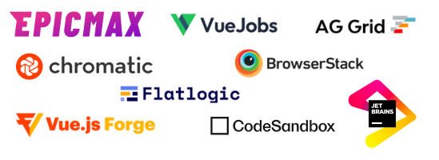

<p align="center">
  <a href="https://vuestic.dev" target="_blank">
      
  </a>
  <br>
  Vue.js 3.0 UI Library
  <br>
  Developed by <a href="https://epicmax.co">Epicmax</a>. Designed by
  <a href="https://twitter.com/xxsavitski">Vasili Savitski</a>.
  <br>
</p>

<p align="center">
  <a href="https://app.circleci.com/pipelines/github/epicmaxco/vuestic-ui">
    
  </a>
  <a href="https://github.com/epicmaxco/vuestic-ui/blob/develop/LICENSE.MD">
    
  </a>
  <a href="https://www.npmjs.com/package/vuestic-ui">
    
  </a>
</p>

<p align="center">
  <a href="https://github.com/epicmaxco/vuestic-ui/tree/develop/packages/vue-cli-plugin">
    
  </a>
    <a href="https://github.com/epicmaxco/vuestic-ui/tree/develop/packages/vue-cli-plugin">
    
  </a>
  <a href="https://github.com/epicmaxco/vuestic-ui/tree/develop/packages/extensions/ag-grid-theme">
    
  </a>
</p>

<p align="center">
  <a href="https://gurubase.io/g/vuestic-ui">
    
  </a>
</p>

<p align="center">
  <a href="https://vuestic.dev/">Documentation</a>
  |
  <a href="https://discord.gg/u7fQdqQt8c">Discord</a>
</p>

> Vuestic UI is forever free and open to contributions. See our
<a href="https://github.com/epicmaxco/vuestic-ui/issues">issues</a>,
<a href="https://vuestic.dev/en/contribution/guide">contributing guide</a> and join discussions on our
<a href="https://discord.gg/u7fQdqQt8c">Discord</a> to help us improve Vuestic UI experience.

<p align="center">
  
</p>

### Quick start
Use following command to quickly scaffold new Vite or Nuxt project with [Vuestic](ui.vuestic.dev)  or [Vuestic Admin](admin.vuestic.ui)

```bash
npm create vuestic@latest
```

### Documentation

Documentation, guides, examples and tutorials are available on [ui.vuestic.dev](https://vuestic.dev)

### Partners & Sponsors ❤️



<br />

<a href="https://www.netlify.com">  </a>

Thanks to [BrowserStack](https://www.browserstack.com/) for providing the infrastructure that allows us to test using all possible browsers.

Thanks to [Chromatic](https://www.chromatic.com/) for providing the visual testing platform that helps us review UI changes and prevent visual regressions.

Become a partner: [hello@epicmax.co](mailto:hello@epicmax.co)

### Community

Feel free to ask any questions or contact us at the official community [Discord server](https://discord.gg/u7fQdqQt8c)

### Vuestic Admin

See Vuestic UI library in
action. [Vuestic Admin](https://github.com/epicmaxco/vuestic-admin) is a great
example of a real-world web application based on Vuestic UI.

### Contributing

Thanks for all your wonderful PRs, issues and ideas.

<a href="https://github.com/epicmaxco/vuestic-ui/graphs/contributors">
  
</a>
<br />

You’re always welcome to join: check out
our <a href="https://vuestic.dev/en/contribution/guide">
contribution guides</a>
, [open issues](https://github.com/epicmaxco/vuestic-ui/issues)
and [Discord server](https://discord.gg/u7fQdqQt8c)


### Can I hire you guys?
[Epicmax](https://epicmax.co) is committed to Open Source from its beginning.
[Vuestic UI](https://vuestic.dev) was created and backed by Epicmax, and is supported through all the years. 
You can request a consultation or order web development services by Epicmax via this [form](https://epicmax.co/contacts) 😎

Say hi: <a href="mailto:hello@epicmax.co">hello@epicmax.co</a>. We will be happy to work with you! 

[Other work](https://epicmax.co) we’ve done 🤘

[Meet the Team](https://ui.vuestic.dev/introduction/team)

### Premium Support and Consulting
Get Premium Support & Consulting services through our official development partner, Epicmax. As the main contributor to Vuestic UI and Vuestic Admin, Epicmax brings a wealth of expertise and experience to help you achieve your project goals efficiently and effectively.

[Get a quote](https://www.epicmax.co/?ref=vuestic-consulting)

### Follow us

Stay up to date with the latest Vuestic news! Follow us
on [Twitter](https://twitter.com/vuestic_ui)
or [Linkedin](https://www.linkedin.com/company/18509340)

### License

[MIT](https://github.com/epicmaxco/vuestic-ui/blob/develop/LICENSE.MD) license.
